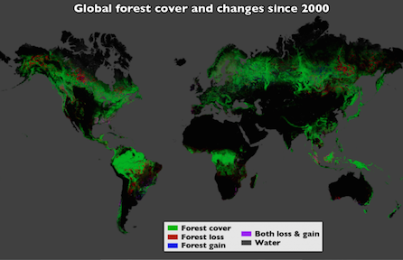
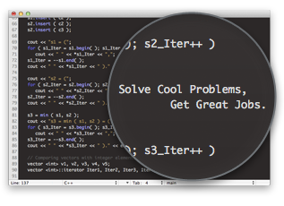
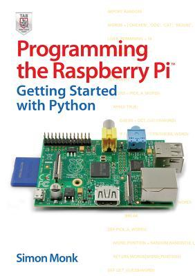
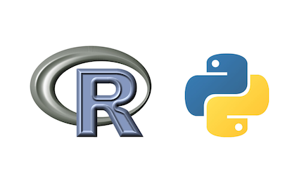
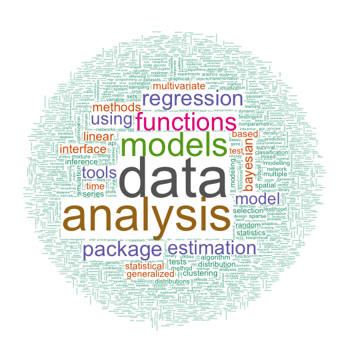

## Did you know?!

Scripting can be used to process satellite data easily to monitor deforestation globally

- Google Earth Engine for global deforestation monitoring
      - https://earthengine.google.org/#intro



Image Credit: NASA Goddard, based on data from Hansen et al., 2013.

## Why geo-scripting?



## Why geo-scripting?

- Reproducible: you keep track of what you have done 

- Efficient: you can write a script to do something and repeat your analysis x1000... 

-	Good for finding errors

Can you think of other advantages?

## Why geo-scripting?

-  Enable collaboration
    - a huge social R and Python community
    


## Why geo-scripting?

- Build your own tools and functions (e.g. automated webprocessing, etc.)



[See Lesson 2 demo's!](https://geoscripting-wur.github.io/Scripting4Geo/#why-scripting)

## Geo-scripting learning objectives

- Read, write, and visualise spatial data using a script
- Find & use libraries, functions for geo-data handling
- Know how to find help
    - Write a clear and reproducible script
    - Learn how to help each other
- Apply learned concepts for your own geo-challenge 

## The geo-scripting course

Goal: Scripting to solve spatial challenges!

* A team of `R` & `Python` experts who use geo-scripting languages 
every day helped to develop this course

* Experts from companies, research institute (Alterra, ISRIC) and 
our own RS and GIS group will present 

## Course planning

See blackboard (planning, Q&A forum, teams)

## Team work & helping each other

- Teams of two:

    - select the team (2 persons, e.g. 1st with 2nd year MGI ) and fill in the form (see blackboard - teams)
    - select also which team will review your exercise

- Other teams can be selected for the project work

<div class="centered">

</div>

## Team work & helping each other

- The Question and Answer forum (see blackboard):
    - Try to obtain the highest score (overall score, best question, best answer)
    - Ask at least one good question
    - Answer at least one question

http://www.geo-informatie.nl/courses/grs33806/question2answer/index.php

See the forum and try to answer a question now and login, otherwise your question will be anonymous

## Individual assessment

- Question and answer forum
- DataCamp website: challenges
- Script reviewing can be done on an individual basis, via script review center (bonus)
- Feedback on course content via Github

## Learning outcomes of today:

- Refreshing R skills and assessing scripting skills to see if you have the 
necessary scripting skills to continue with the course
- Able to write a function
- Know how to visualize data (spatial map) in R

*Socrative Quiz at the end of this presentation!*

## The geo-scripting course

- How did the **DataCamp Introduction to R** go?
- Questionnaire on the self-study
    
## What  is a scripting language?

- A scripting language can interpret and automate the execution of tasks, instead of clicking!!!
- A scripting language is the glue, between different commands, functions, and objectives without the need to compile it for each OS (e.g. windows)
- This is different from like C/C++/Fortran 
    - these are languages that need to be compiled first.

## Compiling

Passing the source code through a compiler, which translates the `high-level language` instructions into an `exe`.

```{r, echo=FALSE, fig.align='center', fig.width=6, strip.white=TRUE}
library(png)
library(grid)
img <- readPNG("figs/traditionalCompiler.png")
grid.raster(img)
```

## The main scripting languages for GIS and Remote sensing currently are: 

- R
- Python
- GRASS (grass function are included in QGIS)
- JavaScript for geoweb scripting
- Matlab
- IDL (ENVI)
- ...

## Python versus R

- Python is a general purpose programming language
- R is particularly strong in statistical computing and graphics
- Installing libraries in Python is sometimes challenging
- Syntactic differences between R and Python can be confusing  
- There are many R and Python packages for spatial analyses



## R packages

```{r, fig.align='center', echo=FALSE, message=FALSE}
if (!file.exists(fn <- "figs/worldcloudRpackage.png")) {
    fn <- "figs/worldcloudRpackage.png"
    require(XML)
    require(tm)
    require(wordcloud)
    require(RColorBrewer)
    u = "http://cran.r-project.org/web/packages/available_packages_by_date.html"
    t = readHTMLTable(u)[[1]]
    ap.corpus <- Corpus(DataframeSource(data.frame(as.character(t[,3]))))
    ap.corpus <- tm_map(ap.corpus, removePunctuation)
    # ap.corpus <- tm_map(ap.corpus, tolower)
    #  txt.corpus <- tm_map(txt.corpus, tolower)
    # must be changed to
    ap.corpus <- tm_map(ap.corpus, content_transformer(tolower))
    ap.corpus <- tm_map(ap.corpus, function(x) removeWords(x, stopwords("english")))
    ap.tdm <- TermDocumentMatrix(ap.corpus)
    ap.m <- as.matrix(ap.tdm)
    ap.v <- sort(rowSums(ap.m),decreasing=TRUE)
    ap.d <- data.frame(word = names(ap.v),freq=ap.v)
    table(ap.d$freq)
    pal2 <- brewer.pal(8,"Dark2")
    png(fn, width=1280, height=800)
    wordcloud(ap.d$word,ap.d$freq, scale=c(8,.2),min.freq=3,
    max.words=Inf, random.order=FALSE, rot.per=.15, colors=pal2)
    dev.off()    
}
```



## Python versus R

- Scripts in both languages can be combined:
    - call R from Python using e.g. RPy2
    - call Python from R (http://rpython.r-forge.r-project.org/)
- ... and more: see here for a question asked on [StackExchange for programmers](https://programmers.stackexchange.com/questions/181342/r-vs-python-for-data-analysis)

## R in Python

A very simple example using the Python Rpy2 module:

```{r, engine='python', eval = FALSE}
import rpy2.robjects as robjects
pi = robjects.r['pi']
print(pi[0])
```


## Many programs have support for

- Python (Blender, Sketchup, QGIS, MySQL, PostGIS)
- R (GRASS, QGIS, MySQL, PostGIS)

## Challenge

Login to socrative: http://www.socrative.com

Room: GEOSCRIPTING

Quiz: Geo-scripting intro

## Tomorrow morning

- Finalise the lesson 1 and the excercise
- Look at Lesson 2
    - an overview of what is possible with scripting
    - no need to understand the code: lesson 2 is a demonstration lesson!

[See Lesson 2 demo's!](https://geoscripting-wur.github.io/Scripting4Geo/#why-scripting)

## Time for R action!

- Let's have a look at the questions in lesson 1!
- The excercise of today
