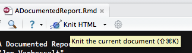

<style type="text/css">
body {max-width: none;}
a:visited {color: #91170a;}
</style>

# [WUR Geoscripting](https://geoscripting-wur.github.io/) 

# Intro to functions and refresher on R

## Learning objectives
* Install packages and create directories in R
* Learn to write a function
* Know how to visualize data via a spatial map using an R script
* Adopt some good scripting/programming habits
* Use control flow for efficient function writing

# Basic *R* knowledge useful for Geo-Scripting
Scripting with *R* to handle spatial problems requires a core set of basic *R* skills. To prepare you well for the coming weeks, we've summarized what we think are important skills for geoscripting below.

```{block type="alert alert-info"}
**Note** that this tutorial uses the basic programming structure with lists, strings, and more. For a refresher on these elements click [here](https://geoscripting-wur.github.io/RPythonBasics/).
```

## Package installation and creating new directories 
To code efficiently, we use packages that contain ready-made features for specific applications. The relevant packages must first be installed before using their features. In this tutorial, we will be using the *terra* and *sf* packages. We can therefore go ahead and install them now. 

```{r}
# Check for the terra and sf packages and install if missing
if(!"terra" %in% installed.packages()){install.packages("terra")}
if(!"sf" %in% installed.packages()){install.packages("sf")}
```

We first check if the package has already been installed, to avoid unnecessary steps. If the package is missing, then we install it. 

```{r}
# Load the terra and sf packages 
library(terra)
library(sf)
```

Similarly, we can create new directories for storing out data using the functions `dir.exists` and `dir.create`. Again, we check if these directories are missing before creating them, to avoid redundancy. 

```{r}
if(!dir.exists("data")){dir.create("data")}
```

## Vector handling and vector arithmetic
**In *R* we call a one-dimensional array of values a *vector*, and a two-dimensional array of values a *matrix*.**

This can be a bit confusing, because R vectors have nothing to do with vectors as you know them in GIS. The latter will be introduced in a later tutorial. You'll also be introduced in a later tutorial to the *terra* package and the `SpatRaster` class that has been developed as part of that package. Since rasters are 2D grids of values, all objects that belong to the class `SpatRaster` are **matrices** with a few more spatial attributes.

As a consequence, handling vectors and matrices is a crucial skill for processing raster data in *R*.

A reference manual for vector handling and vector arithmetic can be found [here](http://cran.r-project.org/doc/manuals/r-release/R-intro.html#Simple-manipulations-numbers-and-vectors).

```{r}
# Create a vector
a <- c(3, 6, 8, 1)
a

# Any mathematical operation can be performed on vectors
(b <- a * 2)
(d <- a + 6)

# Two vectors of same length can also be added with each other
(e <- a + b)

# It works even if their lengths differ, in which case values are "recycled"
(f <- a + b[1:2])
```

Vectors of numbers are called **numeric vectors**, and matrices of numbers are **numeric matrices**. Calculations with matrices work the same way as with vectors, i.e. element-wise. So a multiplication between two matrices is element-wise value multiplication, *not* mathematical matrix multiplication.

### Value replacement

```{r}
## Values in a vector that satisfy a certain condition can be replaced by other values
a <- c(2, 5, 2, 5, 6, 9, 2, 12)

## Values inferior or equal to 5 are replaced by 0
a[a <= 5] <- 0
a

## Condition can be defined using another vector of equal length
a <- c(2, 5, 2, 5, 6, 9, 2, 12)
b <- c(1, 1, 0, 1, 0, 0, 1, 0)

## Change the values of a based on b values
a[b == 0] <- NA
a
```

More complex value replacement:

```{r}
a <- c(2, 5, 2, 5, 6, 9, 2, 12)
b <- c(1, 1, 2, 1, 0, 0, 1, 2)

## a values at which b is equal to either 0 or 1 are replaced by NA
a[b %in% c(0, 1)] <- NA
a
```

```{block, type="alert alert-success"}
> **Question 1:** How do I replace values in `b` by 3 at which `a` is 6, 9 and 12?
```

## Character vector handling

When working with real data, such as satellite imagery or KML files, the data always needs to be read from files. File names and file paths define the location of a file on a computer hard drive. A great advantage of scripting is that locating data, reading and writing data can be fairly easily automated (generate automatic file names, recognize patterns in file names, etc). That requires from the user some basic **character vector** (string) handling skills.

Key functions for handling character strings are listed below:

* `list.files()`: to list files in a directory.
* `glob2rx()`: to select files using a wildcard. Note: if you know regular expressions, you do not need that function. But most people are more comfortable working with wildcards. For a list of wildcards click [here](../Intro2Linux/index.html#file-manipulation).
* `paste()`, `paste0()`, `sprintf()`: useful to combine vectors e.g. to create a file name.
* `strsplit()`: to split up a string.
* `switch()`: to return a value based on a match.

### Example of `list.files()`

```{r, eval=FALSE}
# Check your working directory
getwd()

# List the files available in this directory
list.files()
```

```{block, type="alert alert-success"}
> **Question 2**: List the *directories* in your working directory.
```

### Example of `glob2rx()`

```{r, eval=FALSE}
# List all .txt files in working directory
list.files(getwd(), pattern = glob2rx("*.txt"))
```

### Example of `paste()` and `paste0()`

```{r}
# Two handy examples
paste("Today is", date())
paste0("A", 1:6)
```

```{block, type="alert alert-success"}
> **Question 3**: Create one variable containing a sentence `"geoscripting is fun"`, by combining `a`, `b`, and `c`:
```

```{r, eval=FALSE}
a <- "geoscripting"
b <- "is"
c <- "fun"
```

```{r, echo=FALSE, eval=FALSE}
## what if you only have d, defined as a list?
d <- list(a, b, c)
paste(d) ## this is not good
```

### Example of `strsplit()`

```{r}
# I have the following character string
name <- 'today_is_friday_12-12-2014'

# I want to extract the date contained in it, I can split it based on the underscores and the fourth element should be the date
date0 <- unlist(strsplit('today_is_friday_12-12-2014', split = '_'))[4]

# Which can then be formatted as a date object (until now it is a character string)
class(date0)
(date <- as.Date(date0, format = '%m-%d-%Y'))
class(date)
```

```{block, type="alert alert-success"}
> **Question 4**: How do we select friday from the `name` variable?
```

### Example of `switch()`
Lets say we want to return a custom country code based on the country name
```{r}
# Define country name
country = "Belgium"

# switch()
countrycode = switch(country, "Netherlands" = 1, "Belgium" = 2, "Germany" = 3)

countrycode

```

See also `?substr`, this can be handy too.

## Reading and writing data

In later tutorials we will show you how you can read and write different spatial objects (e.g. vector and raster files).

Here, an example is given how you can read (import into *R*) and write (export from *R*) a text file.

The most common way to read in spreadsheet tables is with the `read.csv()` command. However, you can read in virtually any type of text file. Type `?read.table` in your console for some other examples.

```{r, eval=TRUE}
# Check your working directory
getwd() 

# Create some dummy data
(test <- c(1:5, "6, 7", "8, 9, 10"))

# Write to your working directory
write.csv(test, file = "testing.csv")

# Remove the variable "test" from the R working environment
rm(test)

# Check that the object is no longer in the working environment
ls() 

# Read from your working directory
(test <- read.csv("testing.csv"))
```

## Writing a function

It is hard to unleash the full potential of R without writing your own functions. Luckily it's very easy to do. Here are some trivial examples:

```{r}
# Put the function arguments in () and the evaluation in {}
add <- function(x){
  x + 1
}

add(4)
```

An example of setting the default argument values for your function:

```{r}
add <- function(x = 5) {
  z <- x + 1
  return(z)
}

add()
add(6)
```

That's about all there is to it. The function will generally return the result of the last line that was evaluated.

```{block, type="alert alert-success"}
> **Question 5**: How do you write a function that returns `x` and `z`?
```

Now, let's declare a new object, a new function, `newfunc` (this is just a name and if you like you can give this function another name). Appearing in the first set of brackets is an argument list that specifies (in this case) two names. The value of the function appears within the second set of brackets where the process applied to the named objects from the argument list is defined.

```{r}
newfunc <- function(x, y) {
  z <- 2*x + y
  return(c(z, x, y))
}
```

Next, a new object `a2b` is created which contains the result of applying `newfunc` to the two objects you have defined earlier. The second R command below prints this new object to the console.

```{r}
a2b <- newfunc(2, 4)
a2b
```

Finally, you can now remove the objects you have created to make room for the next exercise by selecting and running the last line of the code.

```{r, eval=FALSE}
rm(a, newfunc, a2b)
```

# Good scripting/programming habits

Increasing your scripting/programming efficiency goes through adopting good scripting habits. Following a couple of guidelines will ensure that your work:

* Can be understood and used by others.
* Can be understood and reused by you in the future.
* Can be debugged with minimal effort.
* Can be re-used across different projects.
* Is easily accessible by others.

In order to achieve these objectives, you should try to follow a few good practices. The list below is not exhaustive, but already constitutes a good basis that will help you getting more efficient now and in the future when working on R projects.

* Comment your code.
* Write [functions](#Function_writing) for code you need more than once:
    - Make your functions generic and flexible, using [control flow](#Control_flow).
    - Document your functions.
* Follow a R [style guide](http://adv-r.had.co.nz/Style.html). This will make your code more readable! Most important are:
    - Meaningful and consistent naming of files, functions, variables...
    - Indentation (like in Python: use spaces or tab to indent code in functions or loops etc.).
    - Consistent use of the assignment operator: either `<-` or `=` in all your code. The former is used by core R and allows assigning in function calls, the latter is shorter and consistent with most other programming languages.
    - Consistent placement of curly braces.
* [Make your own packages](#__optional__Writing_packages_). 
* Keep a similar [directory structure](../RProjectManagement/index.html) across your projects. 
* Use [version control](../RProjectManagement/index.html#version-control) to develop/maintain your projects and packages.
* Never place `rm(list = ls())` anywhere in your script. If you do so, you may [find your computer set on fire](https://www.tidyverse.org/blog/2017/12/workflow-vs-script/).
* Use relative file paths and never use `setwd()`. Do press the button below every time you open a script, and assume everyone else will do that too.

 

Note that R IDEs like RStudio make a lot of these good practices a lot easier and you should try to take maximum advantage of them. Take a moment to explore the menus of the RStudio session that should already be open on your machine.

Below is an example of a function written with good practices and without.
First the good example:

```{r}
ageCalculator <- function(x) {
    # Function to calculate age from birth year
    # x (numeric) is the year you were born
    if(!is.numeric(x)) {
        stop("x must be of class numeric")
    } else { # x is numeric
        # Get today's date
        date <- Sys.Date()
        # extract year from date and subtract
        year <- as.numeric(format(date, "%Y"))
        if(year <= x) {
            stop("You aren't born yet")
        }
        age <- year - x
    }
    return(age)
}

ageCalculator(1985)
```

What a beautiful age for learning geoscripting!

Then the bad example:

```{r}
# DON'T DO THIS, BAD EXAMPLE!!!
funTest_4 <- function(x) {
if( !is.numeric(x))
{
stop("x must be of class numeric"  )
 }
else {
a = Sys.Date()
b<- as.numeric( format( a,"%Y"))
b-x
}
}

funTest_4(1985)
```

Note that this also does work. But which of the two is the easiest to read, understand, and modify if needed? ... Exactly, the first one. So let's look back at the examples and identify some differences:

* Function name: Not very self descriptive in the second example.
* Function description: Missing in the second example.
* Arguments description: Missing in the second example.
* Comments: The second example has none (okay, the first one really has a lot, but that's for the example).
* Variables naming: use of `a` and `b` not very self descriptive in second example.
* Indentation: Missing in the second example.
* Control flow: Second example does not check for implausible dates.
* Consistency: Second example uses spaces, assignment operators and curly braces inconsistently.

You haven't fully understood what control flow is or you are not fully comfortable with function writing yet? We'll see more of that in the following sections.

# Function writing
> A function is a sequence of program instructions that perform a specific task, packaged as a unit. This unit can then be used in programs wherever that particular task should be performed. -[Wikipedia](https://en.wikipedia.org/wiki/Subroutine)

The objective of this section is to provide some help on effective function writing. That is functions that are:

* simple,
* generic, and
* flexible.

They should integrate well in a processing/analysis chain and be easily be re-used in a slightly different chain if needed.
More flexibility in your function can be achieved through some easy control flow tricks. The following section develops this concept and provides examples.

## Control flow
Control flow refers to the use of conditions in your code that redirect the flow to different directions depending on variables values or class. Make use of that in your code, as this will make your functions more flexible and generic.

### Object classes and Control flow
You have seen in a [previous tutorial](../RPythonBasics/index.html/#data-types) already that every variable in your *R* working environment belongs to a class. You can take advantage of that, using control flow, to make your functions more flexible. First, let's introduce a new class.

```{r}
# Check for the terra package and install if missing
if(!"terra" %in% installed.packages()){install.packages("terra")}
library(terra)

c <- rast(ncol = 10, nrow = 10)
class(c)
```

Here we used the function `rast` from the *terra* package to create an object of class `SpatRaster`. `SpatRaster` is a class for rasters (or matrices) that comprise the necessary elements for spatial data. With *terra* and `SpatRaster`, complex spatial data will be processed more efficiently by using specifically tailored functions for `SpatRaster`. This will be studied further in [another tutorial](../IntroToRaster/index.html).

### Controlling the class of input variables of a function

One way of making functions more auto-adaptive is by adding checks of the input variables. Using object class can greatly simplify this task. For example let's imagine that you just wrote a simple Hello World function.

```{r}
HelloWorld <- function (x) {
    hello <- sprintf('Hello %s', x)
    return(hello)
}

# Let's test it
HelloWorld('john')
HelloWorld(2.5)
HelloWorld(c("Devis", "Martin"))
HelloWorld(NULL)
HelloWorld(data.frame(a = 1:10, b = rep("Name", 10)))
```

Surprisingly enough, R is smart enough to give intuitive output in most of the tested cases, since the `sprintf` function automatically casts non-character variables into character ones, and is also vectorised to produce output when the input is a vector. However, in the last two cases, the output is not intuitive. We may want to only allow passing character vectors to this function. We can do this with a small change:

```{r, error=TRUE}
HelloWorld <- function (x) {
    if (!is.character(x))
      stop('Object of class "character" expected for x')

    hello <- sprintf('Hello %s', x)
    return(hello)
}

HelloWorld(21)
```

The function now throws an informative error when something not supported is requested. These function argument "sanity checks" are useful to avoid lengthy processing, when we know that the output of the function is going to be wrong anyway because of invalid arguments. Alternatively to `stop()`, the function could throw a `warning()` but still return some value.

```{block, type="alert alert-success"}
> **Question 6**: In which cases should you use `stop()`, `warning()`, `message()`, and when should you return a string?
```

Note that most common object classes have their own logical function (that returns `TRUE` or `FALSE`) to check what class it is.
For example:

```{r}
# This
is.character('john')

# is similar to
class('john') == 'character'

is.character(32)
is.numeric(32)
```

You should always try to take maximum advantage of these small utilities and check for classes and properties of your objects. This is important in some cases that you might not think of in advance, for instance, consider an object with more than one class:

```{r}
a = list(a = 1:10, b = "b")

# We can also set a class (only do that if you make your own class!)
class(a) = c("myclass", "list")
```

```{r, error=TRUE}
# Wrong
if (class(a) == "list") {
  print("a is a list")
} else {
  print("a is not a list")
}
```

```{r}
# Right
if (is.list(a)) {
  print("a is a list")
} else {
  print("a is not a list")
}
```

Also note that `is.character(32) == TRUE` is equivalent to `is.character(32)`. Therefore when checking logical arguments, you don't need to use the `== TRUE`. As an example, a function may have an argument (say, `plot`) that, if set to `TRUE` will generate a plot, and if set to `FALSE` does not generate a plot. It means that the function certainly contains an if statement. `if(plot)` in that case is equivalent to `if(plot == TRUE)`, it's just shorter (and very slightly faster).

An example, with a function that subtracts 2 SpatRasters, with the option to plot the resulting SpatRaster, or not.

```{r, fig.align='center'}
library(terra)

# Function to subtract 2 SpatRasters
minusRaster <- function(x, y, plot=FALSE) {
    z <- x - y
    if (plot) {
        plot(z, 1) # Plots the first layer of the resulting SpatRaster
    }
    return(z)
}

# Let's generate 2 SpatRasters. The first one is the R logo raster
# converted to the terra package file format
r <- rast(system.file("ex/logo.tif", package = "terra"))

# The second SpatRaster is derived from the initial SpatRaster in order
# to avoid issues of non matching extent or resolution, etc
r2 <- r

# Now we fill the second SpatRaster with new values
# The /10 simply makes the result more spectacular
r2[] <- (1:ncell(r2)) / 10

# Simply performs the calculation
r3 <- minusRaster(r, r2)

# Now performs the calculation and plots the resulting SpatRaster
r4 <- minusRaster(r, r2, plot=TRUE)
```

## Vectorised functions

A lot of core R functions are *vectorised*, i.e. they are capable of taking vectors, rather than individual values, as input. This allows very simple and powerful syntax without needing to use loops, for instance:

```{r}
NumVec = 1:10

# We do not need to run the function on each element individually
as.character(NumVec)

# Functions that reduce input into fewer numbers are also vectorised
mean(NumVec)
range(NumVec)

# All math operators are vectorised
NumVec + 100
NumVec ^ 2
```

Because most base functions are already vectorised, it is easy to write new functions that are themselves vectorised. For the most part, all you need to do is test your functions not just on single values, but also vectors of values, and think whether the result makes sense.

Vectorisation also allows us to write short and versatile code. For instance, to check whether the input is a positive number:

```{r}
is.positive.number = function(x) {
  is.numeric(x) & x > 0
}

is.positive.number(100)
is.positive.number(c(-100, 10, NA))
is.positive.number(c(TRUE, FALSE))
```

```{block, type="alert alert-success"}
> **Question 7**: Why does the following function call return different and counter-intuitive results?
```

```{r}
is.positive.number(c(TRUE, -5, 10))
```

## Type consistency
We just became familiar with functions for checking the types (classes) of variables. You may have noticed that there is one way in which they are all consistent: no matter the input, they return a `logical` value (`TRUE`, `FALSE`, or also `NA`). This is called type consistency and is a useful property. Consider code like this:

```{r}
AddNewSubject = function(NewBirthYear) {
  # Birth years of previous subjects
  BirthYears = c(1980, 1985, 1987, 1990, 1993, 1994, 1998, 2000)
  return(c(BirthYears, NewBirthYear))
}

# Works as expected
NewSubjects = AddNewSubject(c(1995, 1998, 1999, 2000))
sum(NewSubjects >= 2000) # How many subjects are born on or after 2000

# Whoops!
NewSubjects = AddNewSubject(c("MCMXCV", "1998", "1999", "2000"))
sum(NewSubjects >= 2000)
```

```{block, type="alert, alert-success"}
> **Question 8**: What happened, and what would happen if we didn't include the Roman numerals?
```

`AddNewSubject` is not type consistent: depending on the input, the output class changes. This is sometimes convenient, but in the case above, the function succeeds but gives an output that is completely misleading. This has gone horribly right: a lot of code in R is flexible and can handle multiple input types, and so you may only notice that your output is wrong when you inspect it yourself. If the function `AddNewSubject` checked the input and always returned integers, we would be sure that comparing its output against numbers and summing them is safe. Similarly, the `is.numeric()` etc. functions are type consistent, and thus it is safe to use them in `if` statements which always require a logical input. This allows us to not need extra type checking after running such a function. In addition, the function name is hinting towards the type consistency: `is.` makes us realise that it will give a yes/no answer.

## `try()` and debugging

### Use of `try()` for error handling

The `try()` function may help you writing functions that do not stop with a cryptic error whenever they encounter an unknown of any kind. Anything (sub-function, piece of code) that is wrapped into `try()` will not interrupt the bigger function that contains `try()`. So for instance, this is useful if you want to apply a function sequentially but independently over a large set of raster files, and you already know that some of the files are corrupted and might return an error. By wrapping your function into `try()` you allow the overall process to continue until its end, regardless of the success of individual layers. So `try()` is a perfect way to deal with heterogeneous/unpredictable input data.

Also `try()` returns an object of different class when it fails. You can take advantage of that at a later stage of your processing chain to make your function more adaptive. See the example below that illustrate the use of `try()` for sequentially calculating frequency on a list of auto-generated SpatRasters.

```{r, eval=TRUE, echo=TRUE}
library(terra)

# Create a SpatRaster and fill it with "randomly" generated integer values
a <- rast(nrow = 50, ncol = 50)
a[] <- floor(rnorm(n = ncell(a)))

# The freq() function returns the frequency of a certain value in a SpatRaster
# We want to know how many times the value -2 is present in the SpatRaster
freq(a, value = -2)$count

# Let's imagine that you want to run this function over a whole list of SpatRaster
# but some elements of the list are impredictibly corrupted, so the list looks as follows
b <- a
c <- NA
rasterList <- list(a, b, c)

# Now, b and a are SpatRasters, and c is ''corrupted''
```

```{r, error=TRUE}
# Running freq(c) would return an error and stop the whole process
out <- list()
for(i in 1:length(rasterList)) {
    out[i] <- freq(rasterList[[i]], value = -2)$count
}
```

```{r}
# If you wrap the call in a try(), you still get an error, but it's non-fatal
out <- list()
for(i in 1:length(rasterList)) {
    out[i] <- try(freq(rasterList[[i]], value = -2)$count)
}
out
```

```{r}
# By building a function that includes a try() we are able to catch the error 
# without having it printed, allowing the process to handle the error gracefully.
fun <- function(x, value) {
    tr <- try(freq(x = x, value = value)$count, silent=TRUE)
    if (class(tr) == 'try-error') {
        return('This object returned an error')
    } else {
        return(tr)
    }
}

# Let's try to run the loop again
out <- list()
for(i in 1:length(rasterList)) {
    out[i] <- fun(rasterList[[i]], value = -2)
}
out

# Note that using a function of the apply family would be a more
# elegant/shorter way to obtain the same result
(out <- sapply(X = rasterList, FUN = fun, value = -2))
```

### Function debugging

Debugging a single line of code is usually relatively easy; simply double checking the classes of all input arguments often gives good pointers to why the line crashes. But when writing more complicated functions where objects created within the function are reused later on in that same function or in a nested function, it is easy to lose track of what is happening, and debugging can then become a nightmare. A few tricks can be used to make that process less painful.

#### `traceback()` and `debugonce()`
Here are the manual commands, which also work with RStudio and other IDEs:

- The first thing to investigate right after an error occurs is to run the `traceback()` function; just like that without arguments.
- Carefully reading the return of that function will tell you where exactly in your function the error occurred.

```{r, eval=FALSE}
foo <- function(x) {
    x <- x + 2
    print(x)
    bar(2)
}

bar <- function(x) {
    x <- x + a.variable.which.does.not.exist
    print(x)
}

foo(2)
# gives an error

traceback()
## 2: bar(2) at #1
## 1: foo(2)
# Ah, bar() is the problem

# Debug it by declaring what to debug and running it
debugonce(bar)
foo(2)
```

Depending on the IDE you are using, you may be presented with tools for stepping through the function line by line, as well as a Browse console, which allows you to query the state of the variables involved so that you can identify exactly what is going on in the function call. For instance, in RKWard, the *Debugging Frames* pane on the right shows which line you are stepping through.

For another example see: [rfunction.com](http://rfunction.com/archives/2562).

#### RStudio
RStudio has integration with the debugging tools in R, so you can use a point-and-click interface. However, some parts of it are specific to the RStudio IDE.

- To force them to catch every error, select *Debug - On Error - Break in Code* in the main menu.
- Run again ``foo(2)``.
- RStudio will stop the execution where the error happened. The traceback appears in a separate pane on the right.
- You can and use the little green "Next" button to go line by line through the code, or the red Stop button to leave the debugging mode.
- Reset the *On Error* behaviour to *Error Inspector*. In this default setting, RStudio will try to decide whether the error is complex enough for debugging, and then offer the options to "traceback" or "rerun the code with debugging" with two buttons in the console.

Finally, solve the problem:

```{r, eval=FALSE}
# Redefine bar
bar <- function(x) {
    x + 5
}
foo(2)
## [1] 4
## [1] 7
```

Refer to the reference section of this document for further information on function debugging.

```{block, type="alert alert-info"}
# (optional) Writing packages
The next step to write re-usable code is packaging it, so others can simply install and use it. If you followed the steps to here, this step is not very big anymore! For this course, it is optional. Find instructions [here](https://r-pkgs.org/introduction.html) and in the [references](#References_and_more_info) below.
```

# Creating a map within *R* - a simple demo

Here is an example of how you can create a map in *R*. We will make use of a subset of the [Global Adminstrative Areas database (GADM)](http://www.gadm.org):

```{r}
# Create data and output directories and download data from URL
data_URL <- "https://github.com/GeoScripting-WUR/Scripting4GeoIntro/releases/download/gadm-data/gadm41_PHL_2.zip"
data_dir <- "data"

if (!dir.exists(data_dir)) {
  dir.create(data_dir)
}

if (!file.exists('data/data.zip')) {
  download.file(url = data_URL, destfile = file.path(data_dir, "data.zip"))
  unzip('data/data.zip', exdir = 'data')
}
```

We load the administrative boundaries of the Philippines, using the `sf` package, to which you will be introduced more in-depth in a later tutorial:

```{r}
# Check for the sf package and install if missing
if(!"sf" %in% installed.packages()){install.packages("sf")}
library(sf)
  
# Load the data and subset its geometry
adm <- st_read(file.path(data_dir, "gadm41_PHL_2.json"), quiet = TRUE)
adm_geom <- st_geometry(adm)

# Create and example plot
plot(adm_geom[adm$NAME_1 == "Tarlac"])
```

Try to understand the code below, and let us know if you have questions. Feel free to use this code as an example and use this for exercise 3.

```{r phil, eval=TRUE, warning=FALSE, fig.align='center'}
mar <- adm_geom[adm$NAME_1 == "Marinduque"]
plot(mar, bg = "dodgerblue", axes = TRUE)
plot(mar, lwd = 10, border = "skyblue", add = TRUE)
plot(mar, col = "green4", add = TRUE)
grid()
box()
invisible(text(st_coordinates(st_centroid(mar)),
               labels = as.character(adm$NAME_2[adm$NAME_1 == "Marinduque"]), cex = 1.1, col = "white", font = 2))
mtext(side = 3, line = 1, "Provincial Map of Marinduque", cex = 2)
mtext(side = 1, "Longitude", line = 2.5, cex = 1.1)
mtext(side = 2, "Latitude", line = 2.5, cex = 1.1)
mtext(side = 1, line = -2,
"Projection: Geographic\n
Coordinate System: WGS 1984    \n
Data Source: GADM.org    ", adj = 1, cex = 0.5, col = "grey20")
```

# References and more info

- [RStudio Online Learning](https://rstudio.cloud/learn/primers).
- [Coursera](https://www.coursera.org/course/rprog)

<!--
```{block, type="alert alert-info"}
# Optional: Creating documented reports

A great way to avoid clicking and copy pasting is to create a script that combines text (explanation of your script, introduction, or something else) and a R script and creates a report as an html file.

You can create an `.html` from an `.Rmd` file. Click on the following [link](https://rpubs.com/about/getting-started) for getting started and publishing your html to the web.

## RStudio

* In RStudio, create a new R Markdown document by choosing File | New | R Markdown
    * select HTML as a default output format (see screenshot)


In the white parts of the R Markdown you can type anything (such as text or titles), which will not be run as a script. In the grey boxes you can type your code. Running the code can be done with the play button ("run current chunk") on the right top side of the grey box or by clicking in the RMD you can use the shortcut Ctrl + shift + enter to run the whole code chunk. This combination of text and code in R Markdown is very user friendly and makes it easy to make documents with nice visualizations or nicely documented code.

* Click the Knit HTML button in the doc toolbar to preview your document such as the assignment of today.



* In the preview window, click the Publish button.

## CLI or other GUIs

R Markdown is just plain Markdown with blocks of evaluated R code, so you can use any text editor to write it. Then, in order to convert a file called `index.Rmd` into HTML, you can use R functions:

    library(knitrBootstrap)
    library(rmarkdown)
    render('index.Rmd', 'knitrBootstrap::bootstrap_document')

Then you can upload the resulting HTML file anywhere, e.g. on GitHub Pages. In fact, this is how this entire course website is made!

```
-->

<!--
## Dataframe manipulation
This section is also just a draft and should be further elaborated
One central object class of R is the dataframes. The spatial vector classes of R are usually built around dataframes as well, as a consequence, all dataframe manipulation functions and methods are also highly relevant when dealing with spatial vector data in R.

* `str()`
* `subset()`
* `cbind()`, `rbind()`
* Methods with `[,]`, `[,] <-`
* `merge()`

# ```{r, echo=FALSE}
# df <- data.frame(x = 1:10, y = 1:10)
# ## load the googleVis package
# suppressPackageStartupMessages(library(googleVis))
# ## create the scatter chart
# sc <- gvisScatterChart(data=df,
#                         options=list(width=300, height=300,
#                                      legend='none',
#                                      hAxis="{title:'x'}",
#                                      vAxis="{title:'y'}")
#           )
# plot(sc)
# ```
#
# ```{r, results='asis', echo=FALSE}
# print(sc, "chart")  ## same as cat(sc$html$chart)
# ```
-->
